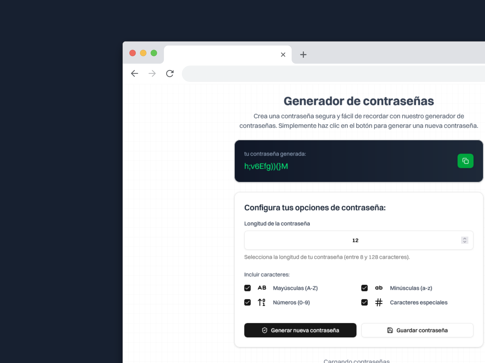

         

# 🛡️ Password Generator

Una herramienta web moderna y segura para generar contraseñas aleatorias y robustas. Diseñada para ayudarte a crear contraseñas únicas que protejan tus cuentas y datos personales.

## ✨ Características

- **🚀 Generación instantánea** - Crea contraseñas al momento con un solo clic
- **⚙️ Altamente personalizable** - Ajusta longitud y tipos de caracteres según tus necesidades
- **🔒 Seguridad garantizada** - Utiliza algoritmos de generación aleatoria seguros
- **📱 Diseño responsivo** - Funciona perfectamente en desktop, tablet y móvil
- **🎨 Interfaz moderna** - Diseño limpio e intuitivo con soporte para tema oscuro/claro
- **📋 Copia fácil** - Un clic para copiar la contraseña generada
- **💾 Historial opcional** - Guarda contraseñas generadas (encriptadas)
- **⚡ Rendimiento optimizado** - Construido con Next.js y Turbopack

## 🎯 Opciones de Personalización

- **Longitud variable** - Desde 4 hasta 128 caracteres
- **Letras mayúsculas** (A-Z)
- **Letras minúsculas** (a-z)
- **Números** (0-9)
- **Símbolos especiales** (!@#$%^&\*()\_+-=[]{}|;:,.<>?)
- **Exclusión de caracteres ambiguos** - Opción para evitar caracteres como 0, O, l, I

## 🚀 Demo

Prueba la aplicación en vivo: [Password Generator](https://passswordforge.netlify.app/)

## 💻 Tecnologías Utilizadas

- **Next.js** - Framework React para aplicaciones web
- **React** - Biblioteca para construir interfaces de usuario
- **TypeScript** - JavaScript con tipado estático
- **Tailwind CSS** - Framework CSS para diseño moderno
- **Radix UI** - Componentes primitivos accesibles
- **React Hook Form** - Manejo eficiente de formularios
- **Zod** - Validación de esquemas TypeScript
- **Prisma** - ORM para base de datos
- **TanStack Query** - Manejo de estado del servidor
- **Lucide React** - Iconos modernos

## 📦 Instalación y Uso Local

### Prerrequisitos

- Node.js 18+
- pnpm (recomendado) o npm

### Pasos de instalación

1. **Clona el repositorio**

   ```bash
   git clone https://github.com/ingfranciscastillo/password-generator.git
   ```

2. **Navega al directorio**

   ```bash
   cd password-generator
   ```

3. **Instala las dependencias**

   ```bash
   # Con bun (recomendado)
   bun install

   # O con npm
   npm install
   ```

4. **Configura las variables de entorno**

   ```bash
   # Copia el archivo de ejemplo y configura tus variables
   cp .env.example .env.local
   ```

5. **Configura la base de datos**

   ```bash
   # Genera el cliente de Prisma
   bun prisma generate

   # Ejecuta las migraciones (si las hay)
   bun prisma db push
   ```

6. **Inicia el servidor de desarrollo**

   ```bash
   bun dev
   ```

7. **Abrir en el navegador**

   Visita [http://localhost:3000](http://localhost:3000) para ver la aplicación.

### Scripts disponibles

- `bun dev` - Inicia el servidor de desarrollo con Turbopack
- `bun build` - Construye la aplicación para producción
- `bun start` - Inicia el servidor de producción
- `bun lint` - Ejecuta el linter para revisar el código

## 🔧 Estructura del Proyecto

```
password-generator/
├── app/                           # App Router de Next.js
│   ├── (dashboard)/              # Grupo de rutas del dashboard
│   │   ├── _actions/            # Server Actions
│   │   │   ├── create-password.action.ts
│   │   │   ├── delete-password.action.ts
│   │   │   └── get-password.action.ts
│   │   ├── _components/         # Componentes específicos del dashboard
│   │   │   ├── form-create-password.tsx
│   │   │   ├── form-save-password.tsx
│   │   │   ├── password-delete-dialog.tsx
│   │   │   ├── password-list.tsx
│   │   │   └── password-options-tags.tsx
│   │   └── page.tsx             # Página principal del dashboard
│   ├── favicon.ico              # Favicon de la aplicación
│   ├── globals.css              # Estilos globales
│   ├── layout.tsx               # Layout principal
│   ├── page.tsx                 # Página de inicio
│   └── theme-providers.tsx      # Proveedores de tema
├── components/                   # Componentes React reutilizables
│   └── ui/                      # Componentes de UI (Radix + Tailwind)
├── generated/                    # Archivos generados
├── lib/                         # Utilidades y configuraciones
│   ├── encrypt.ts              # Funciones de encriptación
│   ├── password.ts             # Lógica de generación de contraseñas
│   ├── prisma.ts               # Configuración de Prisma
│   └── utils.ts                # Utilidades generales
├── prisma/                      # Base de datos
│   ├── migrations/             # Migraciones de la base de datos
│   ├── dev.db                  # Base de datos SQLite (desarrollo)
│   └── schema.prisma           # Esquema de la base de datos
├── public/                      # Archivos estáticos
├── schema/                      # Esquemas de validación
├── package.json                 # Dependencias y scripts
├── tailwind.config.ts          # Configuración de Tailwind CSS
├── tsconfig.json               # Configuración de TypeScript
└── README.md                   # Documentación
```

## 🤝 Contribuciones

Las contribuciones son bienvenidas. Si tienes ideas para mejorar la aplicación:

1. Fork el proyecto
2. Crea una rama para tu feature (`git checkout -b feature/AmazingFeature`)
3. Commit tus cambios (`git commit -m 'Add some AmazingFeature'`)
4. Push a la rama (`git push origin feature/AmazingFeature`)
5. Abre un Pull Request

## 🔐 Seguridad

Esta aplicación:

- ✅ No almacena ninguna contraseña generada
- ✅ Funciona completamente en el cliente (sin envío de datos)
- ✅ Utiliza `crypto.getRandomValues()` para generación segura
- ✅ No requiere conexión a internet después de la carga inicial

## 📝 Licencia

Este proyecto está bajo la Licencia MIT. Ver el archivo `LICENSE` para más detalles.

## 👨‍💻 Autor

**Francis Castillo**

- GitHub: [@ingfranciscastillo](https://github.com/ingfranciscastillo)
- Proyecto: [Password Generator](https://github.com/ingfranciscastillo/password-generator)

## ⭐ ¿Te gustó el proyecto?

Si este proyecto te fue útil, ¡no olvides darle una estrella! ⭐

---

**💡 Consejo de Seguridad:** Recuerda usar contraseñas únicas para cada cuenta y considera usar un gestor de contraseñas para almacenarlas de forma segura.

[](coff.ee/ingfranciscastillo)
